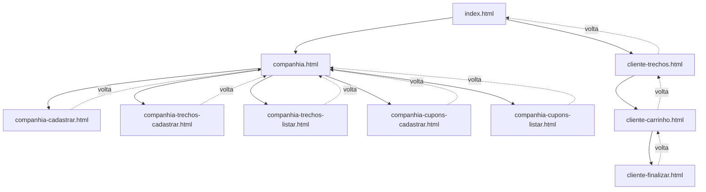

# Projeto Final (Web): Sistema de Passagens Aéreas

## O que é este projeto

Na disciplina anterior, o sistema de passagens rodava no terminal e guardava os dados num banco SQLite. Agora é a vez de transformá-lo num site de verdade: usando HTML, CSS e JavaScript.

A lógica do sistema (companhias, trechos, cupons, carrinho) vocês já conhecem. O que muda é o **onde** e o **como**:

| Antes (terminal) | Agora (web) |
|---|---|
| `console.log` | HTML + CSS na tela |
| `prompt-sync` | Formulários e botões |
| Banco SQLite (`database.js`) | `localStorage` do navegador |

O `localStorage` é uma API que todo navegador já tem pronta. Ele guarda dados em formato **texto**, então tudo que salvarmos ali (arrays, objetos) precisa virar texto antes (`JSON.stringify`) e voltar a ser objeto quando lermos (`JSON.parse`). Ele vai fazer, pra gente, o mesmo papel que o `database.js` fazia: o lugar onde os dados moram de verdade entre uma tela e outra.

**Obs.:** os dados ficam salvos no navegador de quem está usando. Se abrir em outro navegador ou computador, os dados não aparecem — cada navegador tem o seu próprio `localStorage`.

## O que vocês vão praticar

* Estruturar um site com várias páginas HTML que conversam entre si;
* Escrever um CSS único, usando variáveis, Flexbox, Grid e media queries;
* Manipular o DOM com JavaScript (criar elementos, ler formulários, reagir a eventos);
* Persistir dados no navegador com `localStorage`;
* Validar formulários e dar feedback visual sem usar `alert()`.

## Melhorias em relação à versão do terminal

1. **Mensagens de feedback estilizadas** (sucesso/erro), em vez de `console.log` ou `alert()`;
2. **Confirmação antes de excluir** um trecho ou cupom;
3. **Validação de formulário**: campos obrigatórios não podem ficar em branco;
4. **Aviso de "últimas vagas"**: quando um trecho tiver 2 passagens ou menos, ele ganha destaque visual.

---

## Mapa do site (como as telas se conectam)

Antes de programar qualquer coisa, é fundamental entender **por onde a pessoa entra e para onde ela pode ir**. Esse é o mapa de navegação completo do projeto:



Se o seu editor não renderizar o diagrama acima, aqui vai a mesma ideia em forma de árvore de texto:

```
index.html
├── companhia.html
│   ├── companhia-cadastrar.html        (cadastra as companhias)
│   ├── companhia-trechos-cadastrar.html
│   ├── companhia-trechos-listar.html   (editar / excluir)
│   ├── companhia-cupons-cadastrar.html
│   └── companhia-cupons-listar.html    (editar / excluir)
└── cliente-trechos.html
    └── cliente-carrinho.html
        └── cliente-finalizar.html
```

**Ponto de atenção importante:** no sistema do terminal, a companhia era cadastrada "no meio do caminho", dentro do cadastro de trecho ou de cupom. Na versão web isso ficaria confuso — o usuário abriria o formulário de trecho sem nenhuma companhia cadastrada e não saberia o que fazer. Por isso, **`companhia-cadastrar.html` é uma tela própria**, e é o primeiro passo obrigatório de todo o fluxo: sem companhia cadastrada, não é possível cadastrar trecho nem cupom (os formulários dessas telas devem avisar isso ao usuário).

---

## Estrutura de arquivos

```
sistema-passagens-web/
├── index.html
├── style.css
├── dados.js
├── companhia.html
├── companhia-cadastrar.html
├── companhia-cadastrar.js
├── companhia-trechos-cadastrar.html
├── companhia-trechos-cadastrar.js
├── companhia-trechos-listar.html
├── companhia-trechos-listar.js
├── companhia-cupons-cadastrar.html
├── companhia-cupons-cadastrar.js
├── companhia-cupons-listar.html
├── companhia-cupons-listar.js
├── cliente-trechos.html
├── cliente-trechos.js
├── cliente-carrinho.html
├── cliente-carrinho.js
├── cliente-finalizar.html
└── cliente-finalizar.js
```

Cada tela HTML tem o seu próprio `.js` — assim fica claro qual script pertence a qual tela. O único arquivo compartilhado por todas as telas é o `dados.js`.

Rodem este comando no terminal Linux (dentro da pasta onde querem criar o projeto) pra gerar toda essa estrutura de uma vez:

```bash
mkdir -p sistema-passagens-web && cd sistema-passagens-web && \
touch index.html style.css dados.js \
companhia.html companhia-cadastrar.html companhia-cadastrar.js \
companhia-trechos-cadastrar.html companhia-trechos-cadastrar.js \
companhia-trechos-listar.html companhia-trechos-listar.js \
companhia-cupons-cadastrar.html companhia-cupons-cadastrar.js \
companhia-cupons-listar.html companhia-cupons-listar.js \
cliente-trechos.html cliente-trechos.js \
cliente-carrinho.html cliente-carrinho.js \
cliente-finalizar.html cliente-finalizar.js
```

⚠️ **Atenção:** esse projeto não precisa de `npm install` nenhum. É só abrir o `index.html` no navegador (ou usar a extensão **Live Server** do VSCode, pra recarregar a página automaticamente a cada alteração).

---

## Ordem de desenvolvimento

Sigam essa ordem — ela existe porque cada etapa depende da anterior. Não pulem pra parte de JavaScript sem terminar o HTML e o CSS antes.

### Etapa 1 — HTML de todas as telas (sem estilo ainda)

Criem a estrutura de **todas** as páginas listadas no mapa do site, com:
* `<header>` com o título do sistema e um `<nav>` com os links de navegação daquela tela (usem o mapa do site pra saber quais links cada página precisa);
* `<main>` com os elementos da tela: formulários (`<form>`, `<label>`, `<input>`, `<select>`) nas telas de cadastro, e `<table>` nas telas de listagem;
* Um `<div id="mensagem">` vazio em toda tela que tiver alguma ação (cadastrar, editar, excluir) — é ali que o JavaScript vai colocar as mensagens de sucesso/erro mais tarde;
* `<footer>` simples, se quiserem.

Naveguem entre as páginas no navegador clicando nos links, **antes** de estilizar ou programar qualquer coisa. Se todos os links levarem pro lugar certo, essa etapa está pronta.

**Dica:** revisem formulários e validação HTML em [w3schools.com/html/html_forms.asp](https://www.w3schools.com/html/html_forms.asp) e elementos semânticos em [w3schools.com/html/html5_semantic_elements.asp](https://www.w3schools.com/html/html5_semantic_elements.asp).

### Etapa 2 — CSS: base, cores e tipografia

No `style.css`:
* Definam variáveis de cor no `:root` (cor primária, cor de perigo, cor de sucesso, cor de fundo, cor de texto, cor de borda);
* Façam um reset básico (`* { margin: 0; padding: 0; box-sizing: border-box; }`);
* Estilizem `body`, `header` e `nav` usando **Flexbox** (o cabeçalho fica muito mais fácil de alinhar com `display: flex; justify-content: space-between;`).

**Dica:** [w3schools.com/css/css3_variables.asp](https://www.w3schools.com/css/css3_variables.asp) e [w3schools.com/css/css3_flexbox.asp](https://www.w3schools.com/css/css3_flexbox.asp).

### Etapa 3 — CSS: formulários, tabelas, botões e mensagens

* Estilizem `form`, `label`, `input` e `select` (bordas arredondadas, espaçamento, um destaque quando o campo está em foco usando `:focus`);
* Estilizem `table`, `th` e `td`;
* Criem classes de botão (`.btn-primario`, `.btn-perigo`, `.btn-secundario`) com cores diferentes;
* Criem a classe `.mensagem` com duas variações, `.mensagem.sucesso` e `.mensagem.erro` — são elas que o JavaScript vai usar mais tarde pra colorir o feedback;
* Usem os cartões de menu (`companhia.html` e `index.html`) com **CSS Grid** (`display: grid; grid-template-columns: repeat(auto-fit, minmax(200px, 1fr));`), pra eles se organizarem sozinhos na tela.

**Dica:** [w3schools.com/css/css3_pseudo-classes_focus.asp](https://www.w3schools.com/css/css3_pseudo-classes_focus.asp) e [w3schools.com/css/css_grid.asp](https://www.w3schools.com/css/css_grid.asp).

### Etapa 4 — CSS: transições e responsividade

* Adicionem `transition` nos botões e nos cartões (mudança de cor ou uma pequena elevação com `box-shadow` ao passar o mouse);
* Adicionem uma `@media` query pra telas menores que 640px, deixando o cabeçalho e os cartões em coluna única.

**Dica:** [w3schools.com/css/css3_transitions.asp](https://www.w3schools.com/css/css3_transitions.asp) e [w3schools.com/css/css_rwd_mediaqueries.asp](https://www.w3schools.com/css/css_rwd_mediaqueries.asp).

### Etapa 5 — `dados.js`

Esse arquivo faz, pro `localStorage`, o mesmo papel que o `database.js` fazia pro SQLite. Ele **não depende de nenhuma tela específica**, então pode ser escrito e testado isoladamente, direto no console do navegador (F12).

Implementem:
* Constantes com as chaves usadas no `localStorage` (uma pra companhias, uma pra trechos, uma pra cupons, uma pro carrinho);
* Uma função pra **ler** uma lista do `localStorage` (lembrando de usar `JSON.parse` e de retornar um array vazio se ainda não existir nada);
* Uma função pra **salvar** uma lista no `localStorage` (usando `JSON.stringify`);
* Uma função pra **gerar um novo ID**, com base no maior ID já existente numa lista;
* Uma função pra **exibir mensagens de feedback**, que recebe o elemento HTML, o texto e o tipo (`'sucesso'` ou `'erro'`), e usa a classe `.mensagem` que vocês já criaram no CSS.

**Dica:** [w3schools.com/js/js_json_intro.asp](https://www.w3schools.com/js/js_json_intro.asp) e [w3schools.com/jsref/prop_win_localstorage.asp](https://www.w3schools.com/jsref/prop_win_localstorage.asp). Testem assim no console: `localStorage.setItem('teste', JSON.stringify([1,2,3]))` e depois `JSON.parse(localStorage.getItem('teste'))`.

### Etapa 6 — Módulo Companhia

1. **`companhia-cadastrar.js`**: formulário com nome e ano de fundação; ao enviar, valida os campos, cria a companhia (usando `gerarId`), salva na lista e mostra na tabela abaixo do formulário. Sem essa parte funcionando, nada mais do sistema funciona — comecem por aqui.
2. **`companhia-trechos-cadastrar.js`**: o `<select>` de companhia deve ser preenchido com as companhias já cadastradas. Se não houver nenhuma, desabilitem o botão de cadastro e avisem o usuário. Valide os campos e salve o trecho.
3. **`companhia-trechos-listar.js`**: monte a tabela juntando trechos e companhias (é o equivalente do `JOIN` que vocês faziam em SQL, só que em JavaScript, com `.find()`). Cada linha precisa de um botão "Editar" (abre um formulário preenchido com os dados daquele trecho) e um botão "Excluir" (com `confirm()` antes de remover).
4. **`companhia-cupons-cadastrar.js`** e **`companhia-cupons-listar.js`**: repitam a mesma lógica dos trechos, adaptando os campos (código, percentual de desconto, quantidade).

**Dica:** pra criar as linhas da tabela dinamicamente, vejam `createElement` e `innerHTML` em [w3schools.com/js/js_htmldom_html.asp](https://www.w3schools.com/js/js_htmldom_html.asp). Pra lidar com cliques em botões criados dinamicamente, pesquisem sobre **delegação de eventos** (um único `addEventListener` no `<tbody>`, verificando em qual botão o clique aconteceu) — é mais confiável do que colocar um listener em cada botão separadamente.

### Etapa 7 — Módulo Cliente

1. **`cliente-trechos.js`**: liste só os trechos com `numeroPassagens > 0`, com um filtro por companhia. Cada linha tem um botão "Adicionar ao Carrinho", que salva o trecho escolhido na lista do carrinho no `localStorage`.
2. **`cliente-carrinho.js`**: leia o carrinho, exiba os itens numa tabela com botão de remover, e calcule o subtotal.
3. **`cliente-finalizar.js`**: campo pra aplicar cupom (validando se existe e se ainda tem cupons disponíveis), um resumo com subtotal/desconto/total, e um botão de confirmar compra que diminui `numeroPassagens` de cada trecho comprado, diminui `numeroCupons` se houver cupom aplicado, e esvazia o carrinho.

---

## Testando o sistema

Sigam essa ordem, igual fizemos na versão do terminal:

1. Abram o `index.html` e cliquem em "Sou Companhia";
2. Cadastrem uma ou duas companhias em `companhia-cadastrar.html`;
3. Cadastrem alguns trechos e cupons;
4. Voltem para "Início" e entrem como "Sou Cliente";
5. Adicionem trechos ao carrinho, testem remover um item, e finalizem uma compra com e sem cupom;
6. Voltem para a tela de Companhia e confirmem que o número de passagens e de cupons diminuiu.

**Obs. 2:** se quiserem "zerar" o sistema durante os testes, abram o console do navegador (F12) e digitem `localStorage.clear()`.

## Guardando o projeto no GitHub

1. Criem um repositório **privado** chamado `sistema-passagens-web`;
2. Enviem todos os arquivos da pasta usando a opção `Upload files`;
3. Como esse projeto não depende de servidor, também dá pra ativar o **GitHub Pages** (em *Settings > Pages*) e deixar o site acessível por um link público — é opcional, mas é uma boa forma de ver o projeto "no ar";
4. Antes de encerrar, sempre atualizem o repositório com o código mais recente.