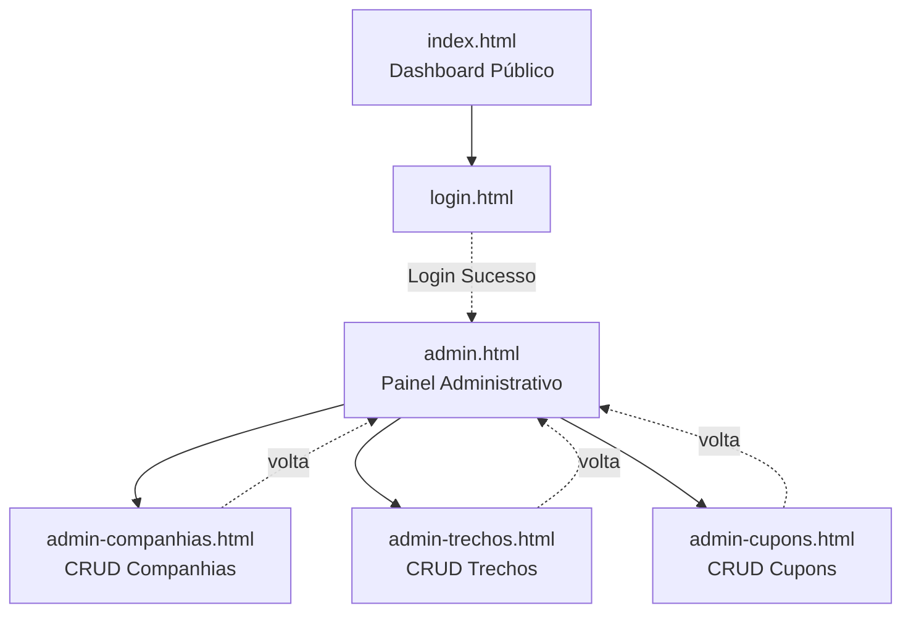

# Projeto Final (Web): Sistema de Passagens Aéreas (Dashboard & Admin)

## O que é este projeto

O sistema de passagens evoluiu para uma arquitetura de portal. Agora, a tela inicial (pública) funciona como um grande **Dashboard de Busca**, onde qualquer visitante pode consultar os trechos disponíveis, aplicar filtros e saber se há cupons. 

Para gerenciar os dados, existe uma **Área Administrativa** protegida por login. Lá dentro, o administrador tem controle total (Adicionar, Ler, Editar e Excluir) sobre as Companhias, Trechos e Cupons.

## O que vocês vão praticar

* Criar um **Dashboard Dinâmico** com múltiplos filtros funcionando em tempo real;
* Estruturar um painel administrativo com fluxo de login simulado;
* Consolidar o **CRUD completo (Create, Read, Update, Delete)** em uma única tela por entidade;
* Manipular o DOM (esconder e mostrar formulários de edição na mesma página).

---

## Mapa do site (como as telas se conectam)

O mapa de navegação foi simplificado e agora foca em separar a área pública da área restrita:

