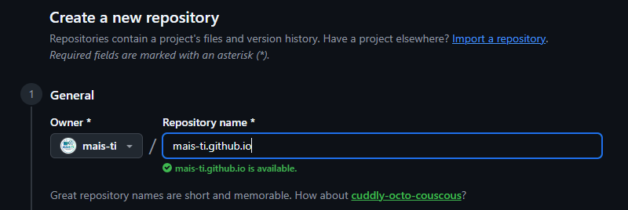
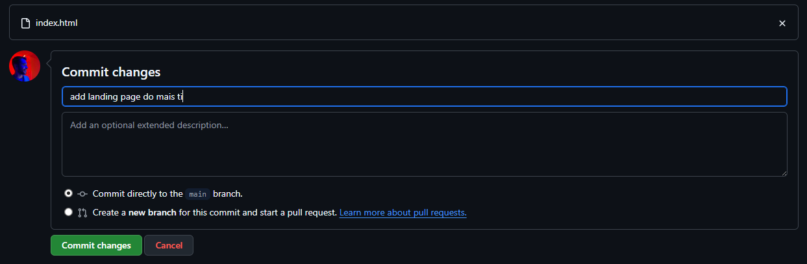
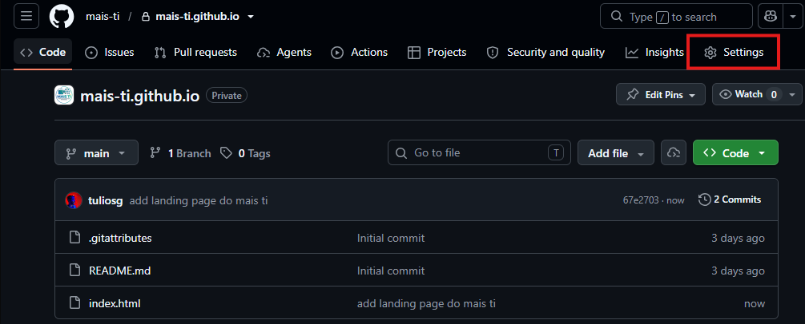
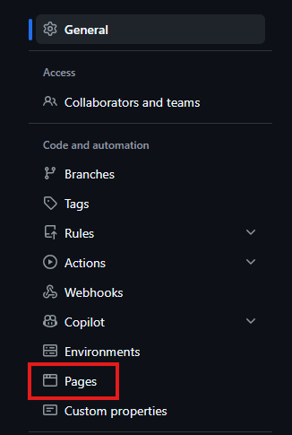
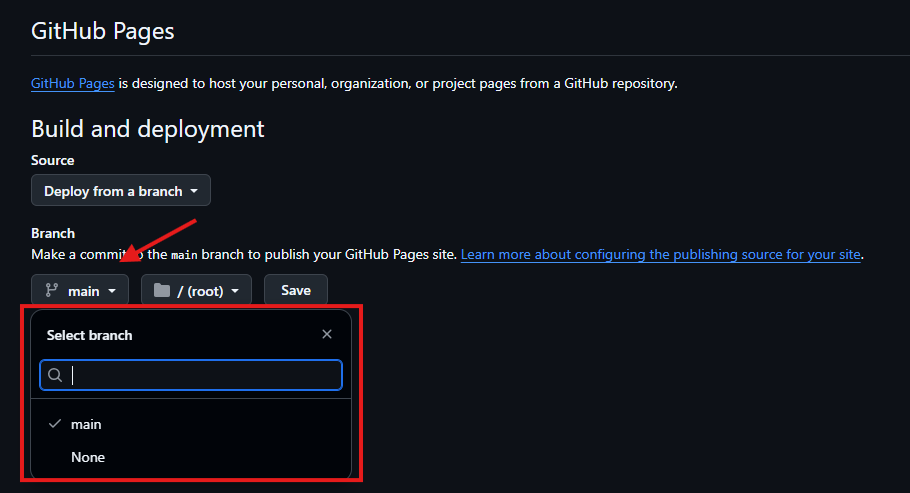
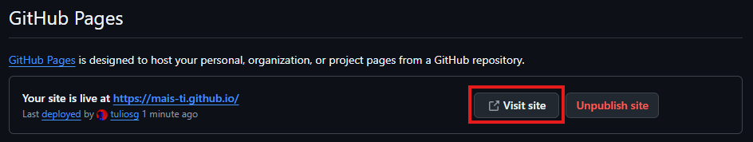

# GitHub Pages
> Tutorial de GitHub Pages da disciplina Desenvolvimento Web

## Introdução
O GitHub Pages é um serviço gratuito do GitHub que publica os arquivos de um repositório como um site na internet, sem que você precise contratar uma hospedagem separada. Ou seja: o mesmo lugar onde você guarda o código do seu site também pode ser o lugar que "entrega" esse site para qualquer pessoa acessar pelo navegador.

Isso é especialmente interessante para quem está aprendendo a programar, porque permite colocar projetos no ar rapidamente.

> [!IMPORTANT]
> O GitHub Pages publica **arquivos estáticos** (HTML, CSS, JavaScript, imagens). Ele **não executa linguagens do lado do servidor**, como PHP, Ruby ou Python. Se o seu site depender de um backend, o GitHub Pages sozinho não é suficiente.

### O que é uma Landing Page?
Uma landing page é uma página única, focada em apresentar algo de forma direta: um projeto, um produto, um evento ou até você mesmo como profissional. Diferente de um site com várias seções e menus complexos, a landing page tem um objetivo claro: comunicar rápido e levar quem está visitando a tomar uma ação, como conhecer um projeto ou entrar em contato.

Para quem está começando na área de TI, saber criar e publicar uma landing page traz alguns ganhos práticos:
* **Portfólio:** é uma forma simples de mostrar seus projetos para recrutadores e clientes, sem depender de outra pessoa para colocar o site no ar.
* **Prática de deploy:** você aprende, na prática, como um site sai do seu computador e vai para a internet — um passo que muita gente só vê depois de formada.
* **Baixo custo:** com o GitHub Pages, essa publicação é gratuita para repositórios públicos.

Neste tutorial, vamos publicar a landing page do projeto Mais TI como exemplo — mas o passo a passo é o mesmo para qualquer site seu, feito só com HTML e CSS.

## Antes de começar
Para seguir este tutorial, você vai precisar de:
* Uma conta no GitHub (veja como criar em [GitHub.md](./GitHub.md));
* Os arquivos do site prontos, com pelo menos um arquivo `index.html`.

> [!IMPORTANT]
> O GitHub Pages sempre procura por um arquivo chamado `index.html` (ou `index.md`/`README.md`) para saber qual página mostrar primeiro. Sem esse arquivo na raiz do site, o GitHub Pages não consegue publicar nada.

## Publicando o mais-ti.github.io
Vamos publicar o site do projeto Mais TI como o site oficial da organização no GitHub, disponível em `https://mais-ti.github.io`. Esse é o tipo mais direto de site do GitHub Pages: o repositório se torna o próprio site, sem nenhuma subpasta no endereço.

### 1. Crie o repositório do site
1. No canto superior direito de qualquer página do GitHub, clique no ícone "+" e selecione **New repository**.

2. Dê o nome `mais-ti.github.io` ao repositório.

   

   > [!IMPORTANT]
   > Esse nome precisa ser **exatamente** `<nome-de-usuário>.github.io` (tudo minúsculo). É essa nomenclatura especial que faz o GitHub reconhecer o repositório como o site do seu perfil.

3. Marque o repositório como **Public** e ative a opção **Add a README file**.

   > [!IMPORTANT]
   > Para usar o GitHub Pages gratuitamente (contas GitHub Free), o repositório precisa ser **público**.

4. Clique em **Create repository**.

### 2. Suba os arquivos do site
Com o repositório criado, envie os arquivos da landing page usando o mesmo processo de upload que já vimos: **Add file → Upload files**.

No caso do site do Mais TI, os arquivos enviados são:
* `index.html`: a página principal do site;
* `logo-mais-ti.png`: a imagem da logomarca usada na página.



Não esqueça de fazer o **Commit changes** para salvar os arquivos, exatamente como fizemos na criação da estrutura de pastas.

> [!TIP]
> Se o CSS do seu site estiver em um arquivo separado (por exemplo, `style.css`), basta subir esse arquivo também e referenciá-lo no `index.html` com `<link rel="stylesheet" href="style.css">`. O GitHub Pages publica qualquer arquivo estático presente no repositório, então isso funciona normalmente — não é obrigatório escrever o CSS dentro do próprio HTML.

### 3. Configure a fonte de publicação
Agora vamos avisar ao GitHub qual branch e pasta ele deve publicar como site.

1. No repositório, clique em **Settings**.

   

2. Na barra lateral, na seção "Code and automation", clique em **Pages**.

   

3. Em "Build and deployment", no campo "Source", selecione **Deploy from a branch**.

4. Logo abaixo, no menu de "Branch", selecione o branch `main` e a pasta `/ (root)`. Clique em **Save**.

   

> [!IMPORTANT]
> Pode levar até 10 minutos para o site ficar disponível depois do primeiro push. Se, depois desse tempo, o site ainda não tiver atualizado, revise se o arquivo `index.html` está mesmo na raiz do repositório.

### 4. Acesse o site publicado
Depois de clicar em **Save**, volte à página "Pages" das configurações. O GitHub vai mostrar o endereço do site e um botão **Visit site**.



Como o repositório se chama `mais-ti.github.io`, a URL final fica direto na raiz, sem nenhuma subpasta:
```
https://mais-ti.github.io/
```

> Saiba mais aqui: [Criando um site de páginas GitHub](https://docs.github.com/pt/pages/getting-started-with-github-pages/creating-a-github-pages-site) e [Início Rápido para Páginas do GitHub](https://docs.github.com/pt/pages/quickstart)

## Observações importantes sobre o GitHub Pages
Antes de publicar seus próprios projetos, vale conhecer algumas regras e limitações do serviço:

* **Só arquivos estáticos:** o GitHub Pages não executa código no servidor (nada de PHP, Ruby ou Python rodando por trás). Ele serve exatamente os arquivos HTML, CSS, JS e imagens que você subir.
* **Várias páginas HTML, sem problema:** você pode ter quantos arquivos `.html` quiser no repositório (`sobre.html`, `contato.html`, etc.). Cada um vira uma página do site, acessível pelo próprio nome do arquivo (ex.: `mais-ti.github.io/sobre.html`). O arquivo `index.html` é o único com papel especial: é a página inicial, aberta quando alguém acessa o endereço do site sem digitar um arquivo específico.
* **CSS em arquivo separado funciona normalmente:** você pode (e geralmente é uma boa prática) criar um `style.css` à parte e importar com `<link>`, em vez de escrever tudo dentro do HTML.
* **Por padrão, o GitHub processa o site com Jekyll:** quando a publicação é feita a partir de um branch, o GitHub Pages usa o Jekyll por trás dos panos. Isso não muda nada no nosso caso, já que estamos publicando HTML e CSS puros — o Jekyll simplesmente publica os arquivos como estão. Não vamos entrar em detalhes de Jekyll neste tutorial, mas é bom saber que esse nome existe caso você o veja na documentação oficial.
* **O site publicado é sempre público:** mesmo que o repositório seja privado (disponível em planos pagos), o site publicado pelo GitHub Pages fica acessível para qualquer pessoa na internet. Por isso, não coloque informações sensíveis nos arquivos do site.

> Saiba mais aqui: [Documentação do GitHub Pages](https://docs.github.com/pt/pages)

## Outra opção: site de projeto
Além do site que acabamos de publicar, o GitHub Pages tem um segundo formato de publicação: o **site de projeto**. A diferença está só no nome do repositório e na URL final — todo o restante do passo a passo (upload de arquivos, configuração da fonte de publicação) é **idêntico** ao que já fizemos.

* **Site de usuário/organização** (o que criamos): o repositório precisa se chamar **exatamente** `<usuario-ou-organizacao>.github.io`. Só é possível ter **um** por conta, e ele fica na raiz do domínio: `https://mais-ti.github.io/`.
* **Site de projeto:** o repositório pode ter qualquer outro nome, por exemplo `landing-page-mais-ti`. É possível criar quantos sites de projeto quiser — um para cada trabalho — e cada um fica em um endereço próprio, dentro do `github.io` da conta: `https://mais-ti.github.io/landing-page-mais-ti/`.

Ou seja, se o Mais TI quisesse publicar essa mesma landing page sem ocupar o site oficial (por exemplo, para manter várias versões ou protótipos no ar ao mesmo tempo), bastaria repetir os passos 1 a 4 criando o repositório com o nome `landing-page-mais-ti` em vez de `mais-ti.github.io`. O site ficaria disponível em:
```
https://mais-ti.github.io/landing-page-mais-ti/
```

> [!TIP]
> Sites de projeto são úteis quando você quer publicar vários trabalhos diferentes sem "usar" o seu único site de usuário/organização — por exemplo, um repositório de projeto para cada atividade da disciplina.

> Saiba mais aqui: [O que é GitHub Pages?](https://docs.github.com/pt/pages/getting-started-with-github-pages/what-is-github-pages)

---

## Atividade Prática: Publique sua própria Landing Page
Agora é a sua vez de colocar uma landing page no ar, na sua conta pessoal do GitHub.

#### O desafio

1. **Crie um repositório novo** na sua conta pessoal do GitHub
   * Nome: `<seu-usuario>.github.io` (troque `<seu-usuario>` pelo seu usuário do GitHub, tudo minúsculo)
   * Visibilidade: Público

2. **Suba os arquivos da landing page**

3. **Configure a fonte de publicação**
   * Settings → Pages → Source: `Deploy from a branch` → Branch: `main` / `(root)` → Save

4. **Acesse o link do seu site publicado**

Ao final, você deve ter um link próprio, no formato abaixo, funcionando e pronto para ser compartilhado — inclusive no seu currículo ou perfil do LinkedIn:

```
https://<seu-usuario>.github.io/
```

> [!TIP]
> Se quiser praticar também o outro formato, crie um segundo repositório com um nome qualquer (ex.: `landing-page-mais-ti`) e repita os passos 2 e 3. Esse vai gerar um **site de projeto**, disponível em `https://<seu-usuario>.github.io/landing-page-mais-ti/`.